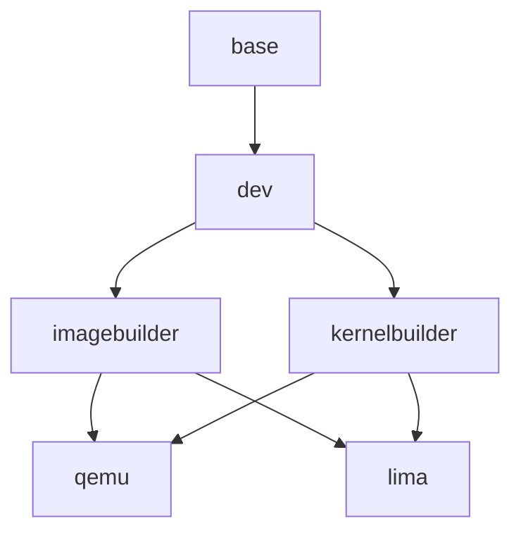

# Garden Linux Dev Image 🐧💻

This virtual machine image based on [the Garden Linux Builder](https://github.com/gardenlinux/builder) is meant for building [Garden Linux](https://gardenlinux.io/).

The dev image provides:
- An isolated and reproducible environment optimized for the Garden Linux development workflow
- An environment to contribute to Garden Linux on non-linux hosts (tested on macOS)
- A selection of helpful tools and configuration geared towards the best developer experience

If you are trying to build Garden Linux on your own machine, and it does not work, please try building it inside the dev image.
Feel free to open an [issue](https://github.com/gardenlinux/gardenlinux/issues/new/choose) if you face any problems when building Garden Linux.

The dev image supports two modes of operation:
- As a [QEMU](https://www.qemu.org) vm (using the `start-vm` script)
- As a [lima-vm](https://lima-vm.io/) (using the [`limactl`](https://lima-vm.io/docs/usage/) command)

Using lima might be desirable for its life-cycle features, but is entirely optional.

The image can be used in combination with [remote development using ssh features by vs code](https://code.visualstudio.com/docs/remote/ssh).

## Requirements

To make use of this development environment, your host machine needs at least 16 GiB of memory and 8 CPU cores.

The `start-vm` script will by default use 8 GiB and 4 cores for running the VM.
It's not recommended to lower those settings, but you might want to increase them based on your available hardware and your use-case.

Your host needs to have [qemu](https://www.qemu.org) installed.

Installing [lima-vm](https://lima-vm.io) is optional based on if you prefer to use it.

## Image Structure

The image is composed of _features_.
Which features are selected at build time determines what the image contains.

This graph explains how the features are connected to each other.



## Downloading pre-built images

Images are built on GitHub Actions and can be downloaded using the `gh` cli tool.

Check for available artifacts via `gh run view` or [on the web](https://github.com/gardenlinux/dev-image/actions).

Select a _variant_ (`imagebuilder` or `kernelbuilder`), a _platform_ (`qemu` or `lima`) and an _architecture_ (`amd64` or `arm64`) of your choice.

Download the image, depending the combination of variant, platform and architecture:

```bash
gh run download --name [ARTIFACT_NAME]
```

## Building the image

> [!NOTE]
> Typically you won't need to build the image yourself.
> In most cases, downloading a pre-built image will be the better option.

To build an image, select a _variant_ (`imagebuilder` or `kernelbuilder`) and a platform (`qemu` or `lima`).

```bash
./build imagebuilder-qemu
```


## Running the virtual machine

To run the virtual machine, either build the image or download a pre-built image.
Be sure to pick the variant that's suitable for your use-case.

### QEMU

This method makes use of the `start-vm` script that's part of this GitHub repo.
Using this method you will be logged in using the `dev` user and you can make use of `sudo` without providing a password.

It's not recommended to work in this shell as the serial console is less reliable than a ssh session.

Both the `dev` user and the `root` user don't have a password.
After starting the virtual machine, create a ssh key using the `make-dev-ssh-key.sh` script.

```bash
git clone https://github.com/gardenlinux/dev-image
dev-image/bin/start-vm [--userconfig username/repo] path-to/(imagebuilder/kernelbuilder)-(qemu/lima)-(arm/amd)64-trixie-*.raw
# Generate ssh key via `make-dev-ssh-key.sh` inside the vm
# Put the generated ssh key (.ssh/id_rsa in the vm) to $HOME/.gardenlinux/dev-id_rsa on your host
dev-image/bin/devssh
```

This provides a ssh login to the virtual machine.

> [!TIP]
> You may provide the optional `--userconfig` argument to `start-vm` which contains the path to a public GitHub repository in the form `username/repo`.
> This repository must contain a executable file `config.sh` which may include custom user-specific configuration, for example to configure git for your name and email.
> See [gardenlinux/dev-image-user-config-template](https://github.com/gardenlinux/dev-image-user-config-template) for an example and template you can build on.

To use it with vs code remote ssh, add an entry like this to your `.ssh/config` file (be sure to replace the path of your home directory):

```
Host gl-dev
  HostName localhost
  StrictHostKeyChecking no
  IdentityFile /YOUR_HOME_DIR/.gardenlinux/dev-id_rsa
  Port 2223
  BatchMode yes
  User dev
```

Now you can connect to the `gl-dev` host and work like you would on your local workstation.

### Lima-VM

[lima-vm](https://lima-vm.io/) is written in go and makes use of QEMU under the hood.
It provides advanced provisioning and life cycle management features which might make it more convenient compared to using `start-vm`.

To use it, get the lima dev vm image (the file ends in `qcow2`).

Create a `gl-dev.yaml` manifest file based on this template, and adjust the path to your image:

```yaml
images:
- location: "./path-to/dev-image.qcow2"

vmType: qemu
os: Linux
memory: 8GiB
containerd:
  system: false
  user: false
provision:
  - mode: system
    script: |
      #!/bin/bash
      set -eux -o pipefail
      export DEBIAN_FRONTEND=noninteractive
      apt-get update
      echo Put your root-permission provisioning here (for example installing additional packages using apt-get)
  - mode: user
    script: |
      #!/bin/bash
      set -eux -o pipefail
      echo Put your user-permission provisioning here (for example cloning your dotfiles, making custom aliases, etc)
```

Create and start the virtual machine:

```bash
limactl create --name gl-dev gl-dev.yaml
echo "Include ${LIMA_HOME:-$HOME/.lima}/gl-dev/ssh.config" >> ~/.ssh/config
limactl start gl-dev
limactl shell gl-dev
```

Connect to host 'lima-gl-dev' in VS Code via the SSH Remote plugin

## Required configuration in the virtual machine

Perform the required git configuration to be able to commit and push code
  - Configure your name and email
  - Configure a [GitHub personal access token](https://docs.github.com/en/authentication/keeping-your-account-and-data-secure/managing-your-personal-access-tokens)

```bash
git config --global user.name "Your Name"
git config --global user.email your-email@example.com
export GH_TOKEN='YOUR_TOKEN'
```
